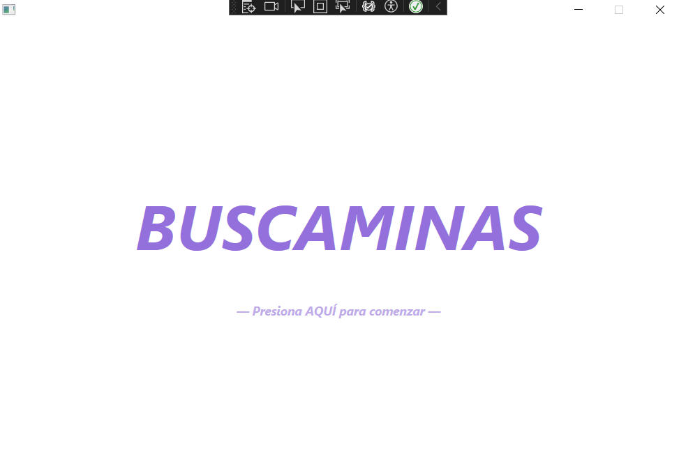
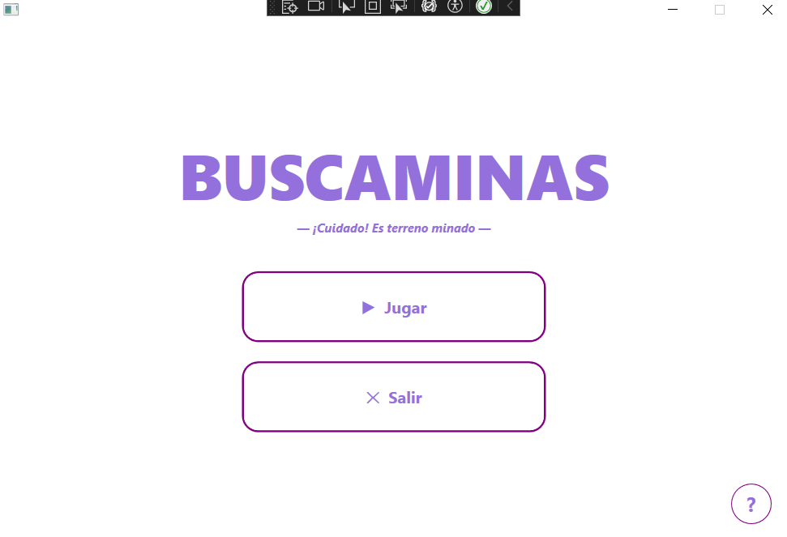
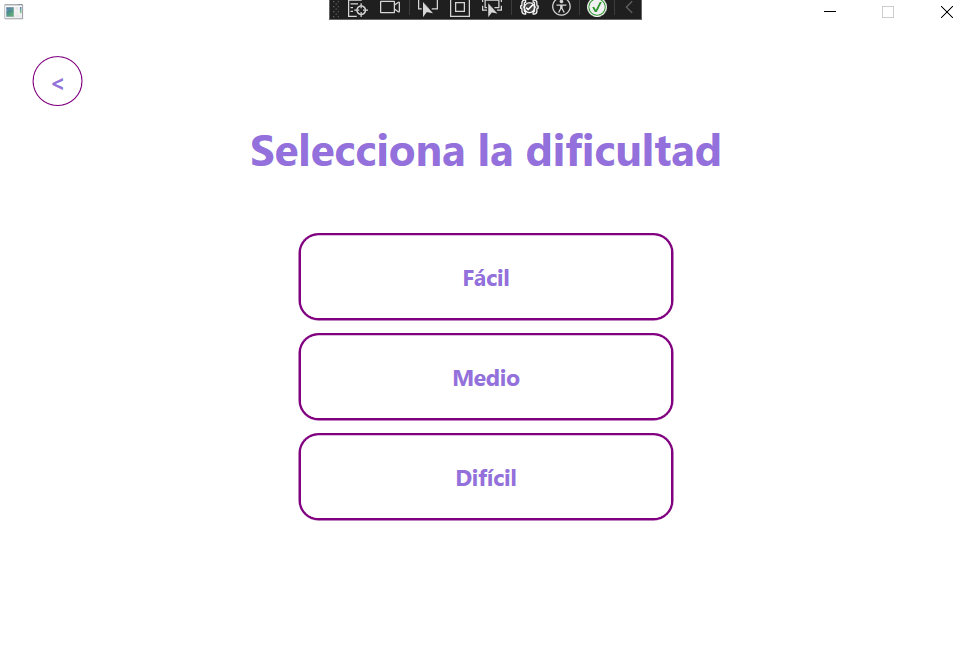
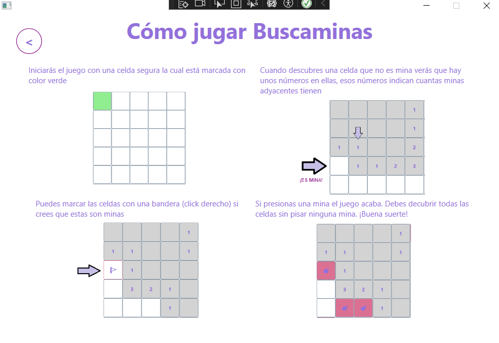
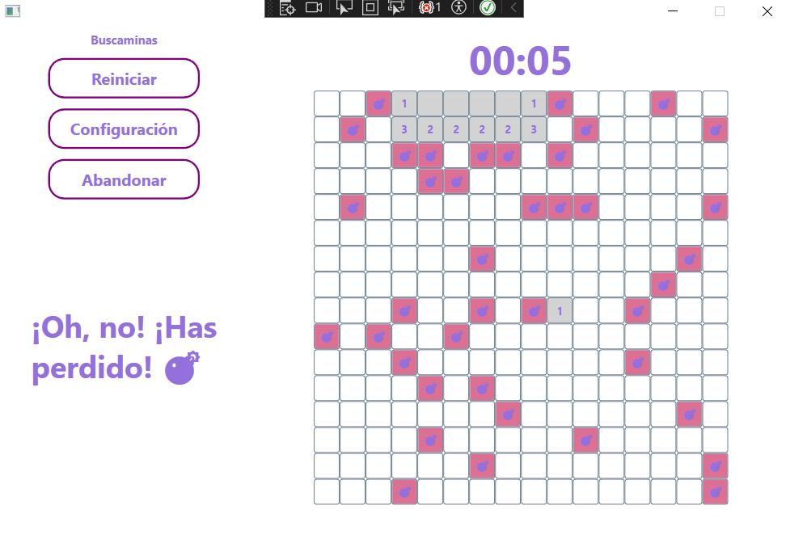

# Buscaminas
Proyecto de práctica en C# con arquitectura **MVVM** y diseño de interfaz en **WPF/XAML**.  
Se buscó recrear el clásico juego de Buscaminas, con un enfoque en buenas prácticas de programación y estructura profesional.

# Características principales
-  Selección de dificultad: fácil, medio y difícil.
-  Tutorial con imágenes 
-  Interfaz gráfica con botones interactivos.  
-  Lógica de juego implementada en C#.  
-  Separación clara entre *Model*, **ViewModel* y **View*.  
-  Uso de *commands* y *data binding*. 

# Estructura del proyecto
Buscaminas.sln
Buscaminas/
Assets/
Models/
Styles/
Utilities/
ViewModels/
Views/
App.xaml
MainWindow.xaml

# Tecnologías utilizadas
- C#  
- WPF / XAML   
- Visual Studio 2022

# Cómo ejecutar
1. Clonar este repositorio:
   ```bash
   git clone https://github.com/JoelLucero11/Buscaminas.git

# Capturas de pantalla







